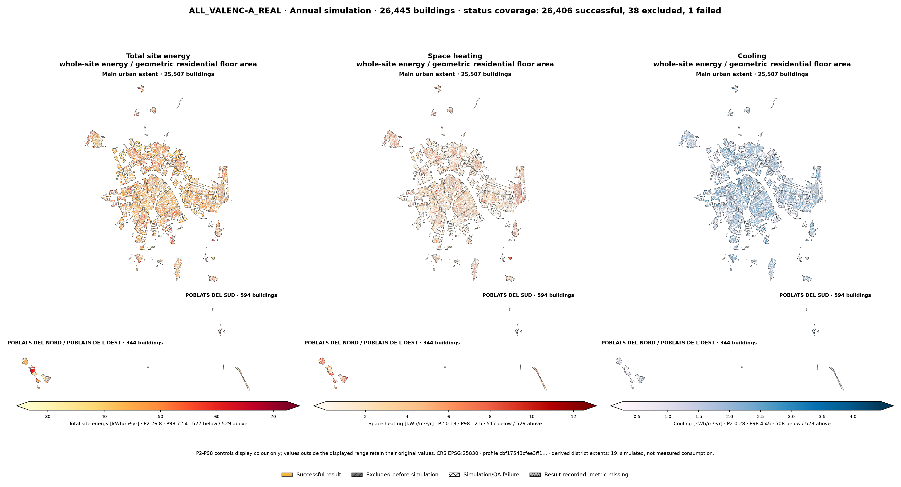
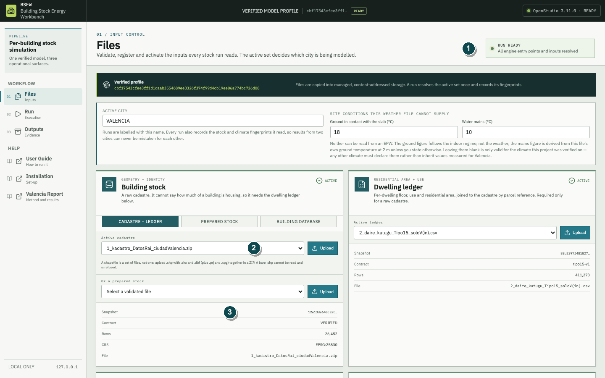
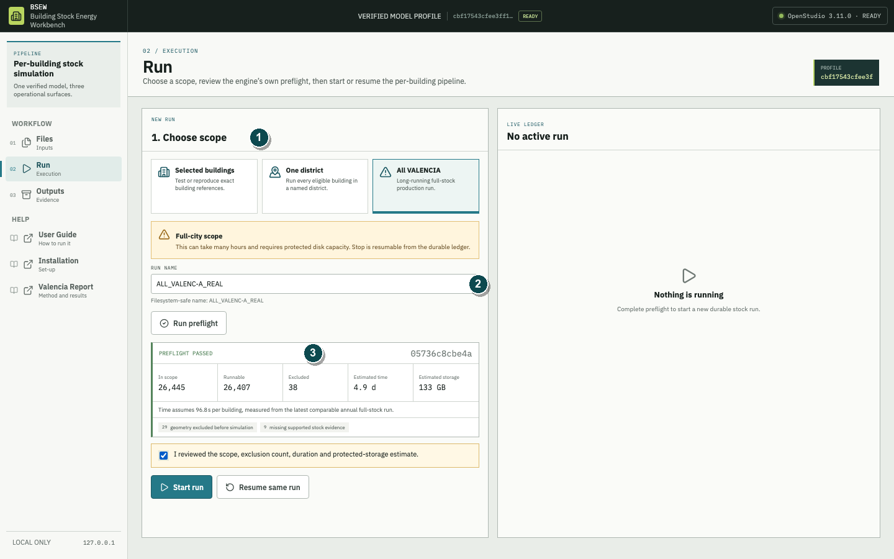
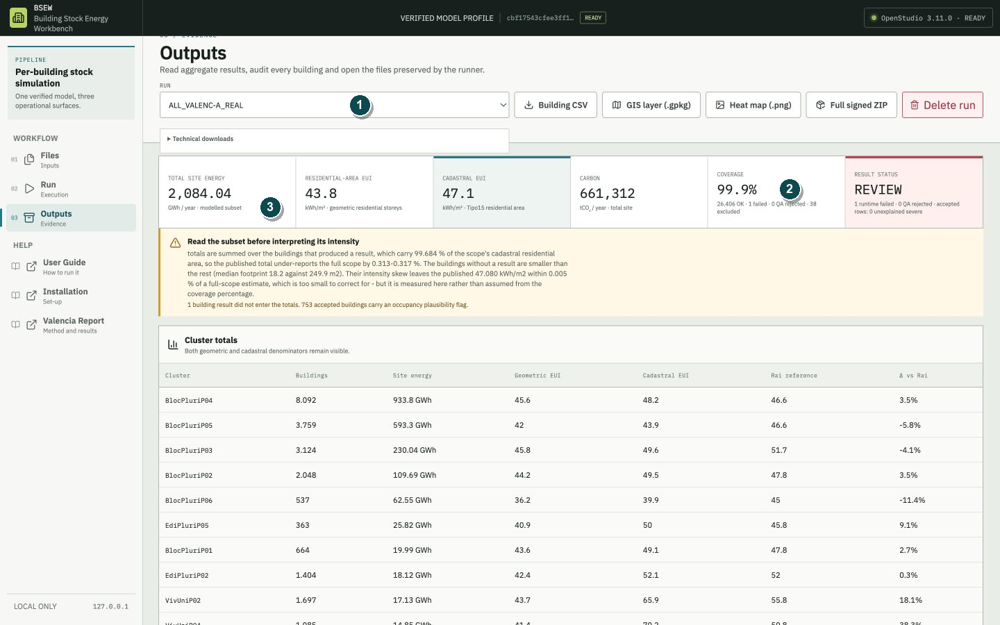
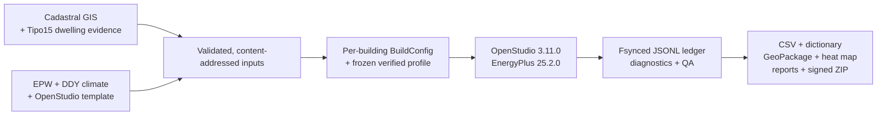

# BSEW — Building Stock Energy Workbench

**A local-first, evidence-preserving workflow for per-building urban energy
simulation with OpenStudio and EnergyPlus.**

[](https://www.python.org/downloads/)
[](https://github.com/NREL/OpenStudio/releases/tag/v3.11.0)
[](https://energyplus.net/)

BSEW converts cadastral building records, dwelling evidence, climate data and a
validated OpenStudio template into reproducible building-stock results. It
records the identity, quality status and preserved evidence of every building
instead of hiding exclusions or failed simulations inside an aggregate.

> **Türkçe özet:** BSEW, Valencia bina stokunu her bina için ayrı ayrı
> modelleyen yerel bir araştırma aracıdır. Girdileri çalışmadan önce doğrular,
> EnergyPlus sonuçlarını dayanıklı bir kayıt zincirinde saklar ve kapsam, kalite,
> enerji, karbon, CSV, GIS ve ısı haritası çıktıları üretir. Sonuçlar ölçüm değil,
> kayıtlı varsayımlar altında üretilmiş simülasyonlardır.

Developed by **Mirza Saribiyik** during an Erasmus+ internship at Universitat
Politècnica de València.

[Results](#valencia-at-a-glance) ·
[Workflow](#one-workflow-files--run--outputs) ·
[Method](#why-the-evidence-is-traceable) · [Install](#install-and-run) ·
[Documentation](#documentation)



*Final spatial evidence for `ALL_VALENC-A_REAL`. Values are simulated rather
than measured; the maps retain all buildings and distinguish successful,
excluded and failed records.*

## Valencia at a glance

The settled annual run `ALL_VALENC-A_REAL` used one verified model profile across
the supplied Valencia stock.

| Scope and status | Final evidence |
| --- | ---: |
| Buildings in scope | **26,445** |
| Successful latest records | **26,406** |
| Excluded before simulation | **38** |
| Runtime failed / QA rejected | **1 / 0** |
| Successful-record coverage | **99.85%** |
| Cadastral residential-area coverage | **99.684%** |

| Result | Final evidence |
| --- | ---: |
| Total site energy | **2,084.03719 GWh/year** |
| Whole-site / cadastral residential area | **47.08 kWh/m²·year** |
| Whole-site / geometric residential area | **43.774 kWh/m²·year** |
| Operational carbon | **661,312.3 tCO₂/year** |
| Spatial summaries | **21 typology clusters · 19 districts** |

These totals represent the buildings that produced a result. They are modelled
site-energy and operational-emissions evidence, **not measured consumption,
building calibration, certification or a forecast guaranteed to match future
operation**. The 39 buildings without a result remain explicit in the coverage
record. Read the [Valencia Simulation Report](docs/guides/published/Building%20Stock%20Energy%20Workbench%20-%20Valencia%20Simulation%20Report.pdf)
before citing the results.

## What BSEW does

- Builds each supported building from its own cadastral footprint, storey
  evidence, dwelling allocation, registered population and surrounding context.
- Resolves period-specific envelope constructions while preserving one frozen,
  verified physical profile for a committed run.
- Runs EnergyPlus 25.2.0 per building and classifies exclusions, engine failures,
  diagnostics and QA outcomes without silently replacing missing evidence.
- Writes a durable JSONL ledger after each building, allowing multi-day work to
  resume only when the run identity still matches.
- Publishes readable summaries, a curated 88-field Building CSV and dictionary,
  GeoPackage/QGIS layers, heat maps, preserved technical evidence and signed ZIP
  exports.
- Keeps annual Valencia studies and short microclimate event studies separate,
  with period-correct units and independent uncertainty records.

## One workflow: Files → Run → Outputs

### 1. Files — validate authoritative inputs



Import the building GIS, Tipo15 dwelling companion, EPW + DDY climate pair and
OpenStudio template. BSEW copies accepted inputs into managed,
content-addressed storage and displays their snapshot identities. A run freezes
the resolved fingerprints; later input changes cannot rewrite earlier evidence.

### 2. Run — inspect the scope before spending compute



Preflight reports the scope, runnable and excluded counts, estimated duration
and protected-storage requirement without starting EnergyPlus. Long runs support
safe stop and identity-checked resume; progress comes from the fsynced ledger,
not only from process memory.

### 3. Outputs — read coverage before the headline numbers



Outputs leads with run identity and coverage, then shows energy, denominator,
period, operational carbon and status. The final Valencia result is honestly
labelled **REVIEW** because one runtime failure remains, even though no completed
building failed QA.

## Why the evidence is traceable



The reference building is scored against **13 verification gates** covering
geometry, envelope, internal gains, domestic hot water, HVAC and total site
energy. The committed profile also pins 23 physical parameters and the SHA-256
identity of the four source modules that define the model. Run identity combines
that profile with climate, template, policy, source-data and schema fingerprints.

This is the governing rule: **refuse rather than guess**. Unsupported geometry,
missing template objects, inconsistent climate files, profile drift and
unclassified severe diagnostics stop or invalidate work. Every refusal keeps its
building reference and reason.

- [13-gate verification record](docs/results/verification_report.json)
- [Final Valencia publication evidence](docs/guides/evidence/valencia-publication-evidence.json)
- [Publication acceptance record](docs/guides/evidence/publication-acceptance.json)
- [Published document manifest](docs/guides/published/document-manifest.json)

## Install and run

### Recommended: verified research distribution

A plain Git clone does not contain the licensed or third-party research inputs
required to reproduce the Valencia application. Use the complete BSEW research
distribution supplied by the project and follow the
[Installation Guide](docs/guides/published/Building%20Stock%20Energy%20Workbench%20-%20Installation%20Guide.pdf).

Required toolchain:

- Python **3.13.x**
- OpenStudio **3.11.0** with EnergyPlus **25.2.0**
- Node.js **20.19 or newer** and npm
- Git for a source checkout or safe updates

macOS or Linux:

```bash
chmod +x scripts/install.sh scripts/start.sh scripts/update.sh
./scripts/install.sh
./scripts/start.sh
```

Windows 10/11 x64, from PowerShell:

```powershell
Set-ExecutionPolicy -Scope Process -ExecutionPolicy Bypass -Force
.\scripts\install.ps1
.\scripts\start.ps1
```

The application opens on the loopback address
`http://127.0.0.1:8765/#/files`. Do not weaken antivirus, Group Policy or
machine-wide execution policy to install it. The Windows procedure has been
checked against the committed scripts and official prerequisites as
**controlled static verification — not executed live on Windows**.

### Source checkout and synthetic tests

Developers can install the pinned dependencies and run tests without publishing
or downloading the restricted Valencia inputs:

```bash
python3.13 -m venv .venv
source .venv/bin/activate
python -m pip install -r requirements.txt
python -m pytest -m "not integration and not slow"

npm --prefix frontend ci
npm --prefix frontend test
```

Tests marked `integration` or `slow`, the verified release check and real
Valencia runs require the corresponding authorised inputs and local simulation
toolchain. Do not start a city run until Files and Run preflight both report the
expected identities and scope.

## Documentation

- **Installation Guide:** supported platforms, exact prerequisites, verified
  installation, updates and troubleshooting —
  [PDF][installation-pdf] ·
  [HTML](docs/guides/published/installation-guide.html) ·
  [DOCX][installation-docx]
- **User Guide:** complete Files → Run → Outputs lifecycle, field definitions,
  QA, reports and exports —
  [PDF][user-guide-pdf] ·
  [HTML](docs/guides/published/user-guide.html) ·
  [DOCX][user-guide-docx]
- **Valencia Simulation Report:** final method, assumptions, provenance,
  coverage, results and academic interpretation —
  [PDF][valencia-report-pdf] ·
  [HTML](docs/guides/published/valencia-simulation-report.html) ·
  [DOCX][valencia-report-docx]

The published edition is dated **28 August 2026** and records software commit
`0836bdb1c689a34d13d1af76f764ed21f42a112b`. Its three document formats were
checked for cross-format parity; the acceptance record also preserves page,
responsive, print and artifact-hash review status.

## Repository map

- `src/verified_model.py` — frozen profile, drift guard and anchor verification.
- `src/deep_building.py` — detailed building geometry, zoning and systems.
- `src/stock_runner.py` — stock orchestration and resumable aggregation.
- `src/workbench/` and `frontend/` — the local BSEW API and interface.
- `scripts/` — installation, start, update, verification and release tools.
- `docs/guides/` — guide sources, evidence, figures and published editions.
- `docs/results/` — public derived evidence, never the restricted inputs.

The older Benicalap run remains a useful bundled demonstration and regression
case. It is not the headline city result; current full-city evidence is always
identified as `ALL_VALENC-A_REAL`.

## Data, reproducibility and citation

The input datasets are not distributed in this public repository. They include
UPV research-group material and third-party cadastral, template and weather
assets, each governed by its own terms. Do not upload them to an issue, pull
request or public fork. `distribution-manifest.json` defines the verified
research payload by role and SHA-256 without turning those inputs into public
assets.

For academic use, cite the report rather than copying an isolated README number:

> Mirza Saribiyik. *Building Stock Energy Workbench: Valencia Simulation Report
> — ALL_VALENC-A_REAL*. 28 August 2026. Software commit
> `0836bdb1c689a34d13d1af76f764ed21f42a112b`.

Contributions should keep physics changes separate from interface or
documentation changes, add evidence-focused regression tests, and never rewrite
preserved run artifacts. The repository does not currently publish a standalone
`LICENSE` file; formalising code licensing is intentionally outside this README
update.

[installation-pdf]: docs/guides/published/Building%20Stock%20Energy%20Workbench%20-%20Installation%20Guide.pdf
[installation-docx]: docs/guides/published/Building%20Stock%20Energy%20Workbench%20-%20Installation%20Guide.docx
[user-guide-pdf]: docs/guides/published/Building%20Stock%20Energy%20Workbench%20-%20User%20Guide.pdf
[user-guide-docx]: docs/guides/published/Building%20Stock%20Energy%20Workbench%20-%20User%20Guide.docx
[valencia-report-pdf]: docs/guides/published/Building%20Stock%20Energy%20Workbench%20-%20Valencia%20Simulation%20Report.pdf
[valencia-report-docx]: docs/guides/published/Building%20Stock%20Energy%20Workbench%20-%20Valencia%20Simulation%20Report.docx
