# BUILDING STOCK ENERGY WORKBENCH
## User Guide

**Author:** Mirza Saribiyik  
**Publication date:** 28 August 2026  
**Reference application:** Valencia building stock  

Building Stock Energy Workbench (BSEW) is a local research interface for preparing, executing, auditing and exporting reproducible building-stock energy simulations. This guide follows the operational path **Files -> preflight -> Run -> safe stop/resume -> Outputs -> building and spatial evidence -> quality assurance -> provenance and citation**.

> **Core interpretation rule.** BSEW produces modelled site-energy and operational-emissions evidence under recorded assumptions. Results are **simulated, not measured consumption**. BSEW does not report building-specific calibration, certification, or a prediction guaranteed to match future operation.

### Suggested citation

Mirza Saribiyik. *Building Stock Energy Workbench: User Guide*. 28 August 2026. Software commit `0836bdb1c689a34d13d1af76f764ed21f42a112b`.

<!-- pagebreak -->

# 1. Purpose, audience and reading path

BSEW is intended for a mixed academic audience: researchers who need a clear main workflow, and technical reviewers who need access to model, simulation, diagnostic and provenance evidence. The main interface therefore has three operational surfaces: Files, Run and Outputs. Expert files remain available as evidence but are not the primary interpretation path.

Use this guide in three ways:

- Sections 2-9 support a first defensible run.
- Sections 10-18 explain outputs, QA and building-level evidence.
- Sections 19-26 establish QA, provenance, limitations, reporting and citation.

The guide does not replace a study protocol. Before running, define the research question, spatial scope, scenario, expected period, exclusion policy, retention level and acceptance criteria. A run name is not a protocol; it is one identifier within a larger evidence chain.

The main worked example is the completed annual run `ALL_VALENC-A_REAL`. No interim total from the running ledger is published as a final result. Figures retain real run and building identifiers while excluding local paths and user information.

## 1.1 Terminology

**Run** means one named stock execution with frozen inputs and profile identity. **Building record** means the latest ledger record for a cadastral reference within that run. **Aggregate** means the derived stock summary. **Evidence** means the preserved inputs, identities, model artefacts, EnergyPlus outputs, QA decisions and exports needed to audit a claim.

<!-- pagebreak -->

# 2. Scientific scope and non-claims

BSEW transforms cadastral and research inputs into simplified OpenStudio/EnergyPlus building models, executes them under a verified profile, records per-building outcomes and derives stock summaries. The application supports reproducibility and inspection; it does not turn uncertain input data into observation.

Do not describe a BSEW result as:

- measured consumption or a utility-bill observation;
- calibration of an individual building unless a separate calibration protocol supplies and evaluates measurements;
- an energy certificate or regulatory compliance decision;
- embodied carbon or whole-life carbon;
- exact attribution of HVAC or domestic hot-water energy to residential versus commercial space;
- a causal estimate of an intervention unless the study design establishes that interpretation.

Annual runs report an annual simulation period. Microclimate event runs report their recorded event date range and duration; they must not be relabelled `/year`. Operational carbon uses recorded final-energy factors and is not a measured emission inventory.

## 2.1 What validation means here

The verified model profile is checked against the project's reference-model evidence and fixed acceptance gates. This supports consistency of the modelling method. It does not mean that every stock building was validated against its own measurements. State this distinction in abstracts, captions and results sections.

The documented software baseline is Python 3.13, OpenStudio 3.11.0 with EnergyPlus 25.2.0, and Node.js 20.19 or newer [1]–[4]. Recording those versions supports method reproducibility; using the specified versions is not itself evidence of physical accuracy.

<!-- pagebreak -->

# 3. Research design before opening the application

Write a short run protocol before using Files:

1. research question and intended comparison;
2. city, district or explicit building scope;
3. annual or event period;
4. input versions and authorised sources;
5. verified profile fingerprint;
6. exclusion and retry policy;
7. retention setting and storage budget;
8. success, QA and diagnostic acceptance rules;
9. planned exports and citation package.

Choose a run name that is unique, stable and meaningful without embedding personal information. Never reuse a completed run name for a different scientific intent. Resume is for the same identity; a changed input, scope or profile requires a new run.

## 3.1 Worked-example identity

The final example is `ALL_VALENC-A_REAL`, a settled full-Valencia annual stock run. Physical results below are copied from the reconciled final aggregate and ledger; they are not recomputed in this guide.

| Evidence item | Settled value |
|---|---:|
| Buildings in scope | 26,445 |
| Successful latest records | 26,406 |
| Runtime failed / QA failed / excluded | 1 / 0 / 38 |
| Successful-record coverage | 99.85% |
| Total site energy | 2,084.037 GWh/year |
| Geometric residential-area intensity | 43.77 kWh/m²·year |
| Cadastral residential-area intensity | 47.08 kWh/m²·year |
| Operational emissions | 661,312.3 tCO₂/year |
| Verified profile | `cbf17543cfee3ff1…` |

These figures describe simulated final site energy and factor-based operational emissions for represented successful buildings. They are not measured utility consumption. The separate *Valencia Simulation Report* provides the complete input, parameter, QA, cluster, spatial, representative-building and limitation evidence.

## 3.2 Reproducibility notebook

Maintain a project log beside the software evidence. Record decisions that the application cannot infer: why the scope was chosen, why exclusions are acceptable, whether a run supersedes another, who reviewed diagnostics, and which export entered the analysis dataset.

<!-- pagebreak -->

# 4. The simulation lifecycle at a glance

BSEW follows one evidence-preserving sequence. Do not enter at Outputs and work backwards from an attractive number. Establish the inputs, test the proposed scope, run the durable ledger, establish that the run has settled, and only then interpret or export the evidence.

1. **Files:** register, validate and activate the authoritative stock, climate and template evidence.
2. **Input validation:** confirm that the visible filename, content fingerprint and validation contract all describe the intended source.
3. **Preflight:** measure the proposed scope without starting EnergyPlus.
4. **Start:** name the run, select the annual or event period and create the durable run identity.
5. **Monitor:** read terminal records from the fsynced ledger and distinguish progress from a final aggregate.
6. **Stop/Resume:** request a safe stop when necessary; resume only the same run and scientific identity.
7. **Outputs:** establish period, completion, coverage and QA before reading totals.
8. **Building audit:** inspect the ledger row, readable report, EnergyPlus tables and geometry.
9. **Export:** choose CSV, GeoPackage, heat map or signed evidence package according to the research claim.

> **Reader checkpoint.** A green input card is not a scientific conclusion, a passed preflight is not a completed simulation, and a completed simulation is not measured or calibrated energy use. Each state answers a different question.

<!-- pagebreak -->

# 5. Files: choose the correct input route

The Files page is a controlled input registry. Uploading copies a source into managed, content-addressed storage and validates its contract. Activating selects which validated snapshot future runs will resolve. These are separate actions: a successfully uploaded file does not silently replace the active study input.

The page begins with the active city, the verified profile fingerprint and two site conditions that an EPW cannot authoritatively supply: ground temperature in contact with the slab and water-mains temperature. For the verified Valencia climate, the interface can show the verified project values. A different climate must declare the ground temperature; water mains may be derived from that EPW's recorded 2 m ground-temperature series or stated explicitly. Never inherit Valencia values merely because the fields were left blank.

Use the following route-selection rule:

| Research situation | Building source | Companion dwelling ledger | Climate | Optional event evidence |
|---|---|---|---|---|
| Valencia raw cadastre | **Cadastre + ledger** | Required Tipo15 CSV | Matching EPW + DDY | None for annual work |
| Engine-ready city stock | **Prepared stock** | Not used | Matching EPW + DDY | Optional |
| Supported EU/GEM database | **Building database** then derived prepared stock | Not used | Matching EPW + DDY | Optional |
| Building-level heat event | Prepared stock or database-derived stock | According to the selected stock route | Matching EPW + DDY | PALM microclimate ZIP required |

In Figure 1, **1** is the readiness banner, **2** is the active cadastre selector for the Cadastre + ledger route, and **3** is the snapshot, contract, row-count and CRS evidence block. The dwelling ledger card beside it must be reconciled before Run.

## 5.1 Tutorial A — raw Cadastre + Dwelling Ledger (Valencia)

This is the route used by the annual Valencia example. It keeps the parcel geometry and administrative building evidence separate from the per-dwelling use and residential-area record.

### Step 1 — select Cadastre + ledger

**Action.** In **Building stock**, select **Cadastre + ledger**. Upload or select a `.gpkg`, `.geojson`, `.json` or `.zip` cadastral source. A Shapefile is supported as a dataset family, but the Files page deliberately refuses a bare `.shp`: package exactly one dataset in a ZIP containing its `.shp`, `.shx` and `.dbf` components. Retain `.prj` so the CRS remains declared, and retain `.cpg` when it defines the source encoding.

**Purpose.** The geometry and parcel identity drive footprint preparation, adjacency, storeys, scope and cluster assignment. For the Valencia contract, the effective roles include parcel identity (`refparcela`), storeys (`altura_max`), population (`pob_total`), dwellings (`num_vivend`), cluster (`cluster`), district/name (`nombre`) and polygon geometry. A field name is not evidence by itself: the active input policy records which field fills each role.

**Expected evidence.** The selected option identifies the managed filename; the compact evidence rows expose the snapshot hash, validation contract, source row count and CRS. Valencia's source is projected in metres. The displayed hash, not the user's original folder, is the reproducible identity.

**Common rejection.** A bare `.shp`, more than one `.shp` dataset in one archive, an incomplete sidecar set, missing or invalid geometry, an undeclared or geographic CRS, blank/duplicate parcel identity, or invalid storeys must be corrected in a new source snapshot. Do not edit the managed copy.

### Step 2 — upload the Tipo15 dwelling ledger

**Action.** In **Dwelling ledger**, upload the `.csv` paired with the cadastre. The accepted contract is a semicolon-delimited Latin-1 file containing `31_pc`, `252_planta`, `428_uso` and `442_sup_Residencial`.

**Purpose.** `31_pc` joins dwelling rows to the cadastral parcel. `252_planta` records the floor label, `428_uso` the use code and `442_sup_Residencial` the positive residential area. These records support ground-use interpretation, residential floor allocation and the cadastral denominator; they are not live occupancy measurements.

**Expected evidence.** The compact card exposes the active filename, snapshot, `tipo15-v1` contract and total rows. Upload validation also checks unique parcels, usable positive-area rows, usable-area coverage and total residential area; these deeper counts belong in the final input manifest rather than being inferred from the compact card. A parcel can have many dwelling rows, so repeated parcel references are not duplicate buildings.

**Common rejection.** Comma-delimited UTF-8 files that merely carry a `.csv` suffix do not meet this contract. Missing required columns, no non-blank `31_pc`, or no positive numeric `442_sup_Residencial` prevents activation. Cadastre parcels without usable joined dwelling evidence may be excluded or use an explicitly recorded fallback; they are never assigned zero consumption merely because the join is absent.

### Step 3 — activate the intended snapshots

**Action.** Select the uploaded cadastre and ledger as active. Re-read the active filename and fingerprint after activation.

**Purpose.** Activation changes only future run resolution. Existing run directories retain their own input and profile identities.

**Expected evidence.** Both cards show active, verified managed datasets and the page readiness moves toward **RUN READY** once climate and template evidence are also complete.

**Common rejection.** Selecting a filename from the registry without activating it leaves the previous snapshot authoritative. Cite the run's recorded fingerprints, not whichever files happen to be active when a report is written later.

<!-- pagebreak -->

## 5.2 Tutorial B — prepared stock

A prepared stock is appropriate when the source has already been translated into the city-neutral fields the simulation engine consumes. It replaces both the raw cadastre and the Tipo15 join; it does not weaken their scientific responsibilities.

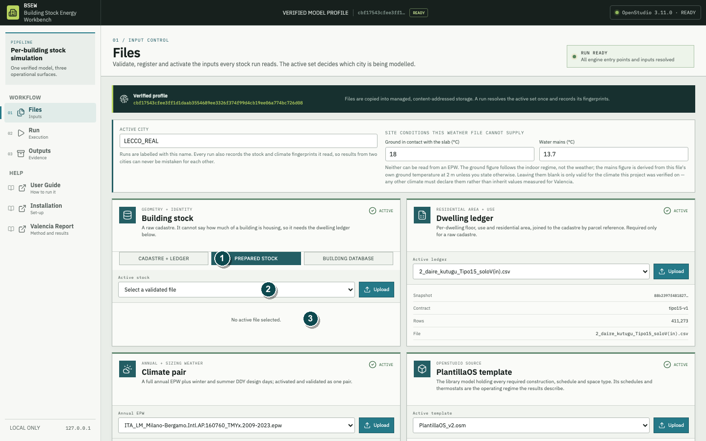

In Figure 2, **1** is the **Prepared stock** route button, **2** is the active-stock selector, and **3** is the explicit no-file state. The identity, geometry, metric-CRS and envelope-or-cluster rules described above are enforced at activation; an empty card does not display them.

### Step 1 — select Prepared stock

**Action.** Select **Prepared stock** and upload or activate a `.gpkg`, `.geojson` or `.json` spatial dataset.

**Purpose.** The file must be self-describing at building level. It must contain `refparcela`, `altura_max`, `pob_total` and `num_vivend`, plus valid polygon geometry in a projected CRS whose unit is the metre.

**Expected evidence.** Validation reports building count, unique references, duplicate-reference rows, CRS, available optional roles and the envelope source.

**Common rejection.** EPSG:4326 or another angular CRS is refused because area, party-wall length and neighbour distance are planar measurements. Empty datasets, missing required fields and duplicate/non-blank identity problems must be fixed before a run.

### Step 2 — establish the construction source

**Action.** Supply either a usable `cluster` value that the pinned Spanish TABULA mapping can resolve, or the complete per-building envelope set `wall_u`, `roof_u` and `window_u`. A `floor_u` column may additionally pin the floor construction.

**Purpose.** A non-Spanish stock must not silently receive Spanish walls. Therefore a partial envelope is not completed from the cluster table.

**Expected evidence.** The compact card reports **Envelope from this file's own U-values** when the complete set is pinned, or the applicable cluster-based source when cluster resolution is used.

**Common rejection.** Supplying only one or two U-value columns is refused. Supplying neither a usable cluster nor the complete pinned envelope is also refused.

### Step 3 — understand why the Dwelling ledger disappears

**Action.** Confirm that the separate Tipo15 card is absent after the prepared stock is active.

**Purpose.** Prepared stock carries the engine-ready occupancy, dwelling and area evidence itself. Attaching a second dwelling ledger would create two competing authorities.

**Expected evidence.** The profile reports `prepared_stock: true`; preflight reads one prepared stock fingerprint rather than a cadastre/Tipo15 pair.

**Common rejection.** Do not interpret the missing Tipo15 card as missing evidence. Instead verify which prepared-stock fields state cadastral area, ground use and any imputation provenance. Absence of an optional field is not numeric zero.

<!-- pagebreak -->

## 5.3 Tutorial C — supported building database to prepared stock (Lecco)

The **Building database** route is an adapter for the supported EU/GEM database contract. It is not a generic SQL importer and must not be described as accepting an arbitrary SQLite database.

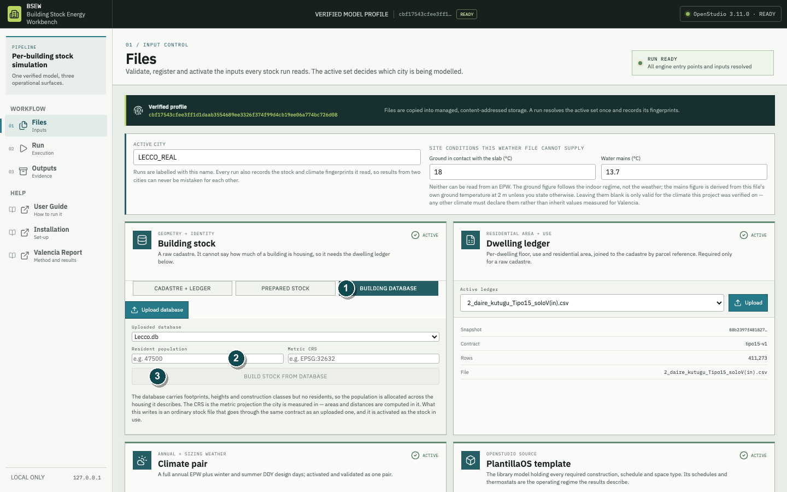

In Figure 3, **1** is the **Building database** route button, **2** is the **Resident population** field, and **3** is **Build stock from database**, the action that converts the registered database into a validated prepared stock.

### Step 1 — upload the database

**Action.** Select **Building database** and upload `.db`, `.sqlite`, `.sqlite3` or `.gpkg`. The Lecco example uses `Lecco.db`.

**Purpose.** The adapter expects an `entities` spatial layer/table containing building identity, geometry and taxonomy/attribute JSON, plus a `taxonomies` source that can resolve priced TABULA_IT construction values.

**Expected evidence.** The database appears in the selector as a managed, verified upload. At this point it is registered source evidence, not yet an engine-ready stock.

**Common rejection.** A file that opens in SQLite but lacks the supported layers and fields is not compatible. Renaming another database to `.db` does not satisfy the contract.

### Step 2 — declare population and metric CRS

**Action.** Enter a positive resident population and a projected metric CRS, then select **Build stock from database**. The Lecco evidence uses a municipal population allocation and `EPSG:32632`.

**Purpose.** The database has no authoritative per-building population. BSEW allocates the declared municipal total in proportion to recorded dwelling area. Reprojection is required before footprint and adjacency measurements.

**Expected evidence.** The derived stock is registered and activated through the same prepared-stock validation gate as a directly uploaded file.

**Common rejection.** Zero/blank population, a geographic CRS, absent source CRS, duplicate `building_id`, no residential entities or no priced TABULA class prevents a valid derivative.

### Step 3 — audit measured and derived fields

**Action.** Review the derived stock's provenance before preflight.

**Purpose.** Lecco takes footprint, height, net floor area, GEM use, period/dwelling bands and TABULA_IT U-values from the database. It derives storeys from height, allocates population, infers missing dwelling counts and flags unresolved construction-period assumptions. These are transparent adapter operations, not new building physics.

**Expected evidence.** The resulting GeoPackage carries the canonical engine roles and explicit provenance fields such as period/dwelling inference and pinned envelope values.

**Common rejection.** Do not report allocated population as measured per-building occupancy or a GHSL epoch as an exact construction year. The Valencia verified profile is a model-method anchor, not measurement calibration of Lecco buildings.

<!-- pagebreak -->

## 5.4 Tutorial D — microclimate event (LECCO_1)

`LECCO_1` is the completed event-run example. It combines an engine-ready Lecco stock, the matching Milano-Bergamo EPW/DDY pair, the OpenStudio template and a PALM temperature slice.

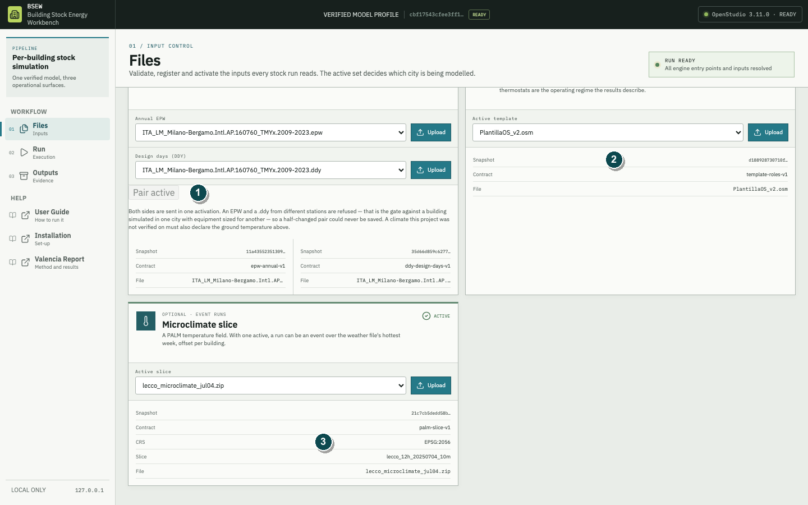

In Figure 4, **1** is the **Pair active** state of the EPW and DDY pair, **2** is the OpenStudio template's snapshot row, and **3** is the microclimate slice with its own contract, CRS and slice identity. The three carry separate fingerprints and are verified separately.

### Step 1 — establish the annual climate pair

**Action.** Upload/select the EPW and DDY separately, then select **Activate climate pair**. An EPW must contain at least 8,760 hourly rows. A DDY must contain at least one WinterDesignDay and one SummerDesignDay.

**Purpose.** EPW weather drives the simulation and DDY evidence defines sizing conditions. The pair is activated atomically so a half-updated climate cannot be saved.

**Expected evidence.** The compact EPW/DDY cards expose the active files' snapshots and validation contracts; the EPW also reports its annual row count. Pair activation validates the two site records and the presence of winter/summer design days. Preserve those resolved site and design-day names in the study's input manifest because the compact cards do not print every validation field.

**Common rejection.** An EPW and DDY from different stations are refused. A non-reference climate must not inherit Valencia slab-ground temperature; its water-mains value must be derived from that climate or stated.

### Step 2 — activate the OpenStudio template

**Action.** Upload or select the `.osm` under **PlantillaOS template**.

**Purpose.** The template supplies the required constructions, schedules, thermostats, space types and system objects. Its validation binds required semantic roles rather than trusting the filename.

**Expected evidence.** The compact card exposes the template snapshot and `template-roles-v1` contract. Upload validation resolves required and optional role bindings; preserve the detailed role report in the study evidence because the compact card does not enumerate it.

**Common rejection.** A syntactically readable OSM can still fail the BSEW template-role contract. Do not replace a role-bound template during a run.

### Step 3 — upload the PALM microclimate slice

**Action.** Upload the validated `.zip` in **Microclimate slice** and activate it.

**Purpose.** The slice provides spatial temperature offsets for individual buildings during an event window. It does not replace all EPW variables and it is not a second annual weather file.

**Expected evidence.** The compact card exposes the dataset snapshot, `palm-slice-v1` contract, CRS and slice name. The loader also validates raster identity, cell-size consistency and declared coverage before registration. The current compact card does not print every loader field; preserve the detailed slice/run record, including event window and coverage note, in the final evidence manifest. Only after activation does **Microclimate event** appear on the Run page.

**Common rejection.** Missing metadata/rasters, incompatible CRS, invalid time coverage or buildings outside the slice prevent an honest event assignment. Any missing hours or night treatment must remain a visible assumption.

### Step 4 — retain the event period in every interpretation

**Action.** Run and read `LECCO_1` as an eight-day event. Its recorded window is `08-16..08-23`.

**Purpose.** The annual-shaped result fields are reused by the runner, but their values belong to the recorded event window.

**Expected evidence.** Outputs displays **Microclimate event run — these are not annual figures**; heat-map panels use `kWh/m² over the 8-day event`, and constant event metrics may be omitted with an explicit note.

**Common rejection.** Never append `/year`, annualise the values silently, or compare them numerically with annual Valencia intensity. Event-period carbon is operational emissions over the event, not annual carbon.

## 5.5 Input interpretation limits

Cadastral records are administrative evidence, not direct geometric surveys. Padrón population is not real-time presence. A prepared stock may contain measured, allocated and assumed fields in the same row; preserve their provenance. The template supplies operating assumptions, not a measurement of each building. A climate pair represents the selected weather evidence, while a microclimate slice supplies only its declared spatial-temporal adjustment.

# 6. Run: preflight, start and monitor

The Run page has two working areas: **New run** on the left and **Live ledger** on the right. The normal workflow is to complete the proposal on the left, pass preflight, start once, and then monitor the resulting identity on the right.

## 6.1 Choose scope

- **Selected buildings** accepts one or more cadastral/building references separated by spaces, commas or semicolons. Use it for reproduction, diagnosis and protocol witnesses.
- **One district** appears only when the active stock supplies a district field. It selects every eligible building in the chosen district.
- **All [city]** is a long-running production scope. It requires explicit acknowledgement after preflight.

Changing scope, district, references, run mode or run name invalidates the displayed preflight. Run preflight again; a previously green card does not authorise a changed proposal.

## 6.2 Choose period

**Annual** runs a full year on the active EPW. **Microclimate event** appears only when a validated slice is active and applies its recorded event window to the weather transformation. Period is part of the run identity and must be recorded in every table and figure.

## 6.3 Name the run

The interface shows the filesystem-safe form of the name as it is typed. Use a stable, meaningful name without relying on punctuation that will be removed or normalised. **Start run** expects a new run identity. **Resume same run** expects an existing directory with the same safe name and matching recorded scope, period, inputs and verified profile.

The current product UI intentionally does not expose worker or retention controls. It submits the tested production contract of **6 workers** and **full per-building retention**. Do not invent editable controls in the methods section; report these recorded settings from the run configuration.

## 6.4 Run preflight

Preflight performs no EnergyPlus stock run. It resolves the proposed inputs and scope, applies screening gates, estimates execution/storage, and reports why any records are excluded.

| Field | What it establishes | What it does not establish |
|---|---|---|
| In scope | All records selected by the scope | That every record is runnable |
| Runnable | Records passing current preparation gates | That EnergyPlus or QA will pass |
| Excluded | Records refused before simulation, with reasons | Zero demand or failed EnergyPlus |
| Estimated time | Projection using the displayed comparable-run rate | A deadline guarantee |
| Estimated storage | Expected full-retention footprint | ZIP size or permanent archive policy |
| Rate basis | Which historical evidence supplied seconds/building | Identical hardware contention or tail cases |

For full-city work, confirm the scope, exclusions, duration and protected-storage estimate before checking the acknowledgement box. Save the profile fingerprint and preflight counts in the project log.

In Figure 5, **1** is the scope selector, **2** is the run name that safe resume depends on, and **3** is the preflight result header above the runnable, excluded, time-basis and storage evidence.

## 6.5 Start once

Before selecting **Start run**, confirm the active city, annual/event period, safe run name, preflight fingerprint, power, storage and absence of planned service/code changes. A successful start notification names the run; the Live ledger panel and Run selector should then show **RUNNING**.

Do not click **Resume same run** merely because Start is disabled or an error occurred. Resume is a recovery operation for a matching existing run, not an alternative start button.

# 7. Monitor, stop and resume

## 7.1 Read the Live ledger

The percentage is terminal records divided by the recorded scope. **OK** means a result entered the successful ledger state, **FAILED** means simulation or evidence production failed, and **EXCLUDED** means the record was screened before EnergyPlus. **CPU** is accumulated worker time, not wall-clock elapsed time.

The progress counts come from the fsynced ledger on disk, not process memory. The process log shows the last 160 KB and supports diagnosis; a log-fetch error does not erase the ledger, while an empty log can simply mean that no new text has been written.

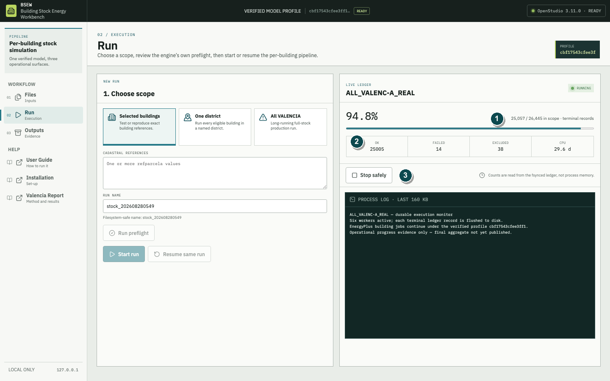

In Figure 6, **1** is the ledger-derived progress counter, **2** is the successful/failed/excluded tile row, and **3** is **Stop safely**. Every count is read from the fsynced ledger rather than from process memory.

This operational figure is not a result figure. **1** is ledger-derived progress, **2** separates the terminal states, and **3** identifies the safe-stop control. The process log supports diagnosis but is not the progress source.

While a run is active, Outputs may show running totals for completed buildings. They are not forecasts of the final aggregate and must never be copied into a publication.

## 7.2 Keep the run environment stable

During a protected stock run:

- keep the host powered and prevent system sleep;
- keep any external run volume attached;
- do not rebuild frontend assets, restart/stop the service, update imported engine code or mutate `out/stock/**`;
- do not move or rename the run directory;
- use only read-only monitoring requests;
- investigate profile/input mismatch messages immediately.

Closing only a browser tab does not itself stop an independently running backend process. Closing the terminal/service process, shutting down or sleeping the computer, ejecting the output volume, or quitting a launcher that owns the backend can interrupt it. Treat the live ledger and process state—not whether a browser window is visible—as authoritative.

## 7.3 Stop safely

Select **Stop safely** when the run must pause. The request asks the runner to stop through its controlled process path and preserves the durable ledger. Wait until the interface reports `running: false` and the recorded process is gone. Do not use force termination as the routine pause mechanism.

## 7.4 Resume the same identity

Restore the same active input snapshots and verified profile, enter the exact same safe run name and scope, run preflight, then select **Resume same run**. BSEW compares the request with the recorded identity. A refusal after a profile, input, period or scope mismatch protects the ledger from becoming a scientifically mixed run; do not bypass it.

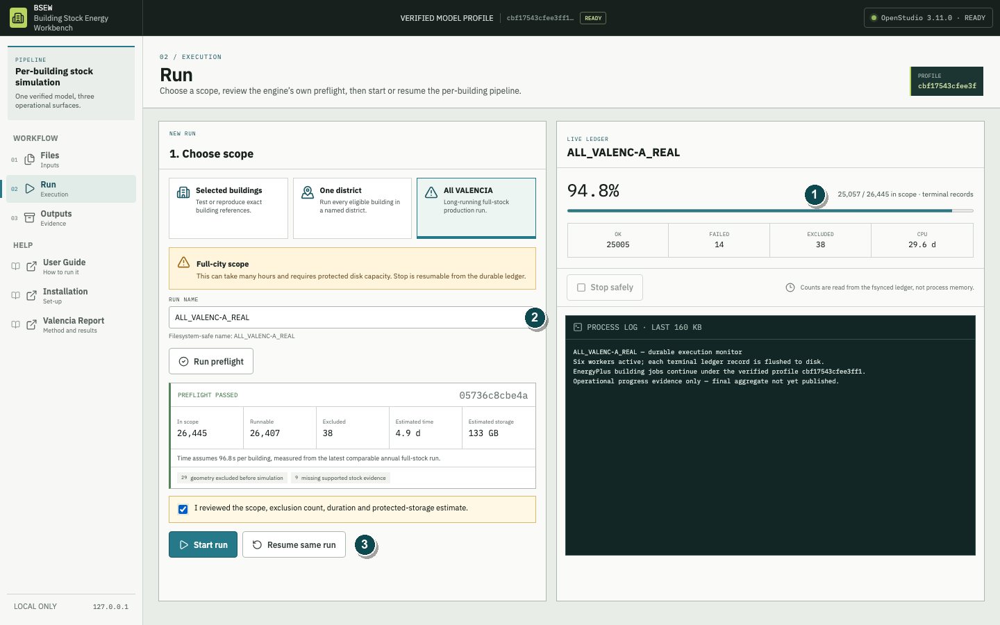

In Figure 7, **1** shows that the durable ledger survived the stop, **2** is the run-name field that must be re-entered exactly, and **3** is **Resume same run**. A refused resume is an identity guard, not a defect to work around.

A run is complete only when:

1. it reports `running: false`;
2. the recorded process no longer exists;
3. the final aggregate is present and readable;
4. latest ledger records reconcile to the recorded scope;
5. final exports are created from that settled state.

Process absence without a final aggregate is interruption, not completion. Inspect the log and resume when the recorded identity still matches.

## 7.5 Failed and excluded records

After a finished run, **Retry failed** appends only the failed references to the same ledger under the runner's retry contract; a later success becomes the latest record. **New run from all** creates a separate `_unfinished` run containing failed and excluded references. Exclusions usually require a changed preparation gate, which changes the verified profile and cannot be appended silently to the historical ledger.

<!-- pagebreak -->

# 8. Outputs: read evidence in the required order

Outputs is not a gallery of interchangeable numbers. Use the following reading order for every run.

## 8.1 Select the run and establish its state

Use the **Run** selector first. A running option is labelled **RUNNING**. Then read any banner before the KPI cards:

- **This run has not finished** means every figure is a running total for completed buildings only.
- **Microclimate event run** means the fields cover the stated event window, not a year.
- **This ledger holds more than one run mode** means no aggregate total can be read as one period.
- A loading/error/empty state is not a zero result; use **Retry** or inspect the ledger.

In Figure 8, **1** is the run selector, **2** is the coverage card that must be read before any intensity, and **3** is the unit, period and denominator line printed under each headline value.

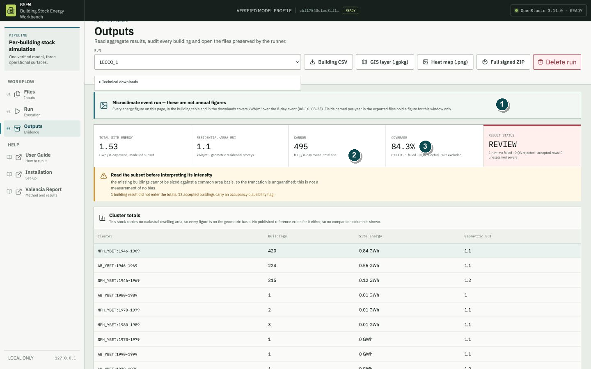

Figure 9 is the period-label test case: **1** is the non-annual event banner, **2** is the eight-day unit line under the operational-carbon value, and **3** is the coverage figure that qualifies every event result.

## 8.2 Read coverage and status before intensity

The KPI row reports Total site energy, the available area-based intensities, operational carbon, coverage and result status. Read **Coverage** and **Result status** first. Failed, QA-rejected and excluded buildings do not become zeros. A coverage note may state that truncation bias is unquantified because missing buildings cannot be sized on a common area basis.

Then name the denominator. **Residential-area EUI** divides whole-site energy by geometric residential storeys. **Cadastral EUI**, when Tipo15 evidence exists, uses cadastral residential area. Conditioned area and residential-attributed energy answer different questions. Similar numbers with different denominators are not interchangeable.

## 8.3 Read cluster totals

**Cluster totals** gives building count, site energy and the available geometric/cadastral intensity for each class. Rai reference and difference columns appear only where that external comparison exists. The comparison is a denominator-aligned research reference, not utility calibration of the simulated buildings.

Do not take an arithmetic mean of building intensities to reproduce a cluster intensity. Use the aggregate's declared energy-over-area weighting.

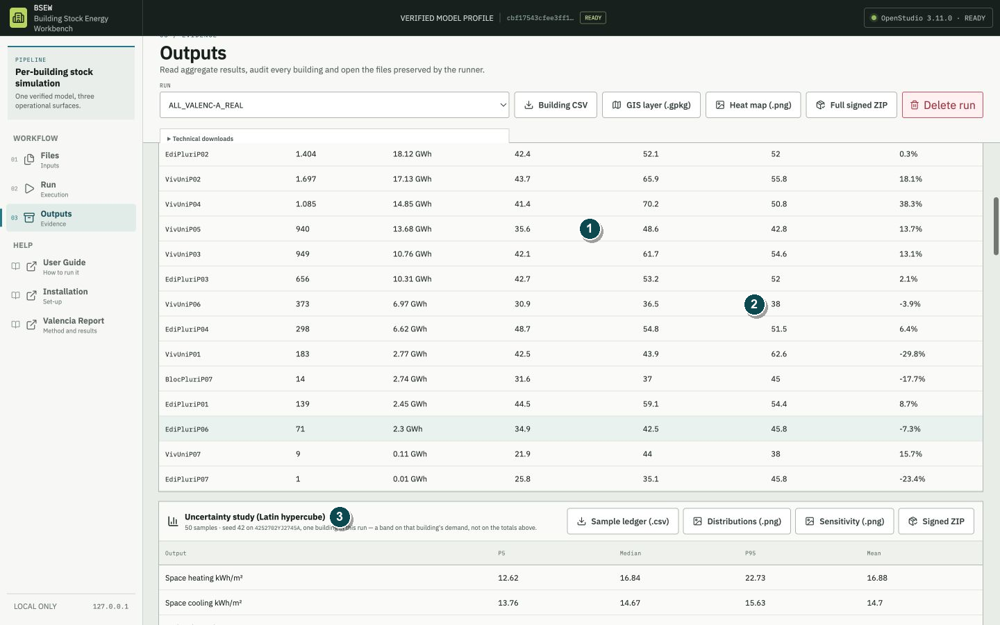

In Figure 10, **1** marks one cluster's geometric and cadastral intensities side by side, **2** marks the Rai reference column, and **3** marks the Latin-hypercube band. This view continues the table whose column headings appear in Figure 8.

## 8.4 Treat uncertainty evidence as contextual

BSEW records **two kinds of Latin-hypercube study**, and the Outputs page shows at most one of them: the study committed to the run you are reading. Both use 50 stratified samples with seed 42 and report P5, median and P95 for one building, never for the stock total.

**Annual study.** The annual study samples envelope, infiltration, shading and post-processing variables for the Valencia pilot reference `4252702YJ2745A`. It reports space heating (P5 12.62, median 16.84, P95 22.73 kWh/m²·year), space cooling (13.76, 14.67, 15.63) and operational carbon (2.10, 3.35, 5.88 kgCO₂/m²·year). This study runs in the retired ideal-loads demand chain, so its band describes that building's sampled **demand**, not the consumption totals published above it.

**Event study.** The event study samples the same building-physics variables plus a microclimate offset scale over a fixed heat event, and it produces **consumption** because the event chain simulates the real heat pump. It is recorded for the Lecco reference `312519537` (cluster `AB_YBET:1946-1969`) over the eight-day window 16-23 August: total site energy P5 1.1417, median 1.1916, P95 1.2714 kWh/m² **for the event**, cooling 0.3826 / 0.4299 / 0.5037 kWh/m², and operational carbon 0.1944 / 0.2980 / 0.3783 kgCO₂/m². Space heating is structurally zero in August, and the coefficient-of-performance variables are deliberately excluded from the register because dividing an already-simulated consumption by a second COP would double-count.

**Reading rule for both.** The section appears only when the study was committed to the selected stock run *and* remains compatible with the currently pinned sources. A stale or unverified study is not hidden, but its statistics are withheld and the changed source roles are named instead. An event band must never be quoted with a `/year` label, and neither band is a confidence interval for a city total.

## 8.5 Resolve unfinished records

The **Unfinished buildings** section distinguishes failed records from pre-simulation exclusions. Read the reason counts before deciding whether to retry. A changed exclusion gate requires a new verified profile and separate run; it must not rewrite the identity of the original aggregate.

## 8.6 Audit the Building ledger

Search by reference, cluster or error text and filter by **OK**, **Failed** or **Excluded**. Each row reports status, reference, cluster, site intensity, total energy, carbon, occupancy plausibility and QA. Select with a mouse or Enter/Space to open **Building evidence**.

The drawer reports the selected row's status and failure reason. Successful rows provide:

- **Geometry check**;
- **Readable building report**;
- **EnergyPlus result tables**;
- direct readable-report links for results, quality, diagnostics, methods and provenance;
- a collapsed list of original technical files;
- **Signed building package**.

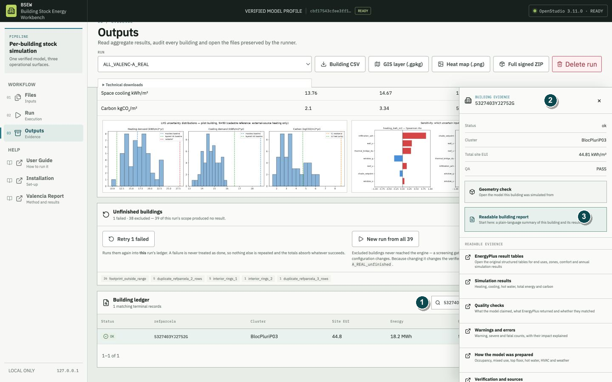

In Figure 11, **1** is the ledger search and status filter, **2** is the selected row's identity in the evidence-drawer header, and **3** is **Readable building report**, the intended entry point before any raw expert file.

## 8.7 Perform the geometry check

The viewer rebuilds the scene from the preserved `model_python.osm`. Use this visual acceptance list:

1. Compare the overall footprint form and orientation with the supplied parcel geometry.
2. Count visible storeys and check whether a partial/top-storey rule is disclosed in the report.
3. Confirm that exterior walls, roof and ground/contact surfaces form a coherent envelope.
4. Check openings by facade and identify unexpected blank facades; a landlocked ground storey can legitimately have no exterior wall or glazing.
5. Inspect adjacent/context masses where they affect exposed surfaces and shading.
6. Compare suspicious geometry with footprint fidelity, storey-rule and QA fields rather than deciding from appearance alone.

Facade WWR is intentionally blank in this viewer because the pipeline's target ratio is not preserved as an independent per-building field and cannot be recovered authoritatively from the OSM alone. The viewer is an audit aid, not a survey or proof of geometric truth.

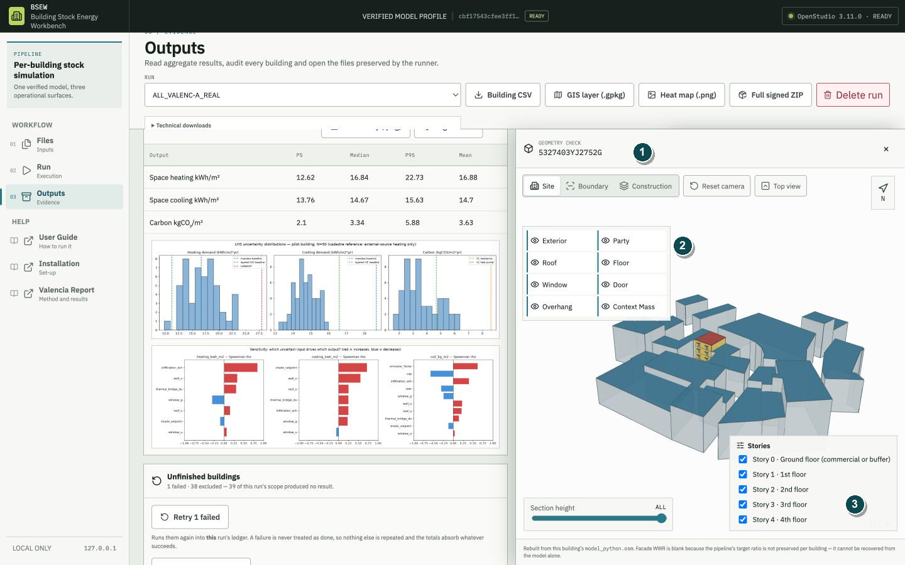

In Figure 12, **1** is the viewer's building reference, **2** is the surface-category panel used for the visual acceptance list, and **3** is the storey list. Facade WWR remains intentionally blank, as the note beneath the viewer states.

## 8.8 Use readable and technical evidence together

Start with the readable building report. It explains period, denominators, status, energy, emissions, geometry, occupancy, QA, diagnostics, assumptions and provenance in academic language. Open `eplustbl.htm` when original EnergyPlus end-use, zone, comfort or annual summary tables are required.

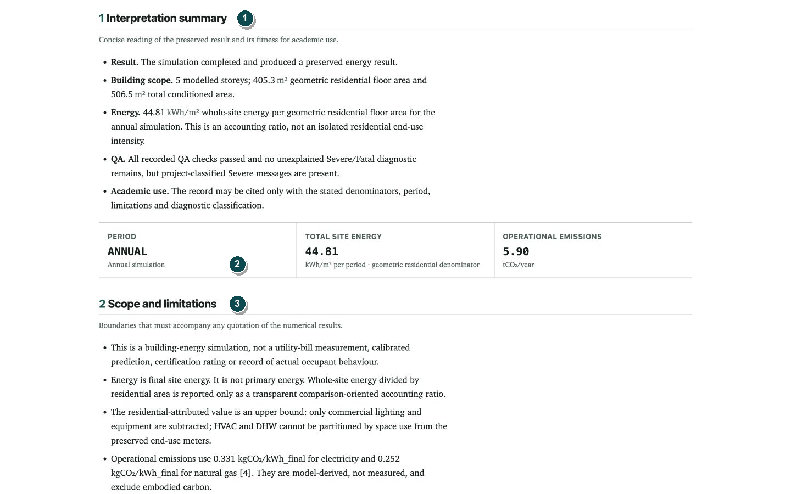

In Figure 13, **1** is the interpretation summary, **2** is the period, energy and emissions strip with its stated denominator, and **3** is the scope-and-limitations section that must accompany any quoted number.

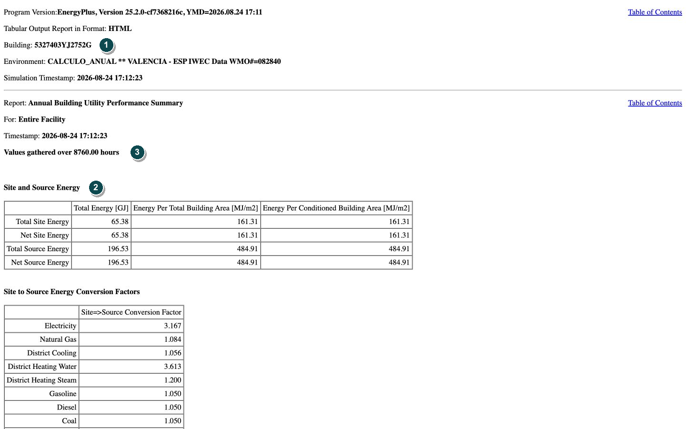

In Figure 14, **1** is the building reference that must match the selected ledger row, **2** is the site and source energy table, and **3** is the recorded 8,760-hour simulation extent. These are engine tables, not measurements.

The original files have narrower specialist purposes:

| File | Purpose | Do not mistake it for |
|---|---|---|
| `deep_layers.json` | Machine-readable preparation, result and QA evidence | A reader-oriented narrative report |
| `model_python.osm` | Generated OpenStudio source model | Measured geometry or an editable master template |
| `eplusout.err` | Original EnergyPlus warning/Severe/Fatal stream | A pass/fail decision without the project QA classification |
| `verified_profile.json` | Pinned profile identity and source hashes | Per-building measurement validation |
| `eplustbl.htm` | Original structured EnergyPlus result tables | The sole statement of BSEW denominator or publication status |

<!-- pagebreak -->

# 9. Download, transfer and deletion controls

## 9.1 Choose the appropriate download

- **Building CSV:** row-level statistical analysis and status reconciliation.
- **GIS layer (.gpkg):** building geometry, joined attributes, aggregate layers and reproducible QGIS style.
- **Heat map (.png):** publication-oriented spatial communication, never the sole numeric evidence.
- **Full signed ZIP:** complete retained run evidence after reviewing the uncompressed size.
- **Signed building package:** focused audit of one reference with its model, outputs, ledger evidence and manifest.

The full ZIP action first reports file count and uncompressed bytes. Confirm the size before creation. An Ed25519 manifest establishes file integrity relative to the signing record; it does not certify scientific validity.

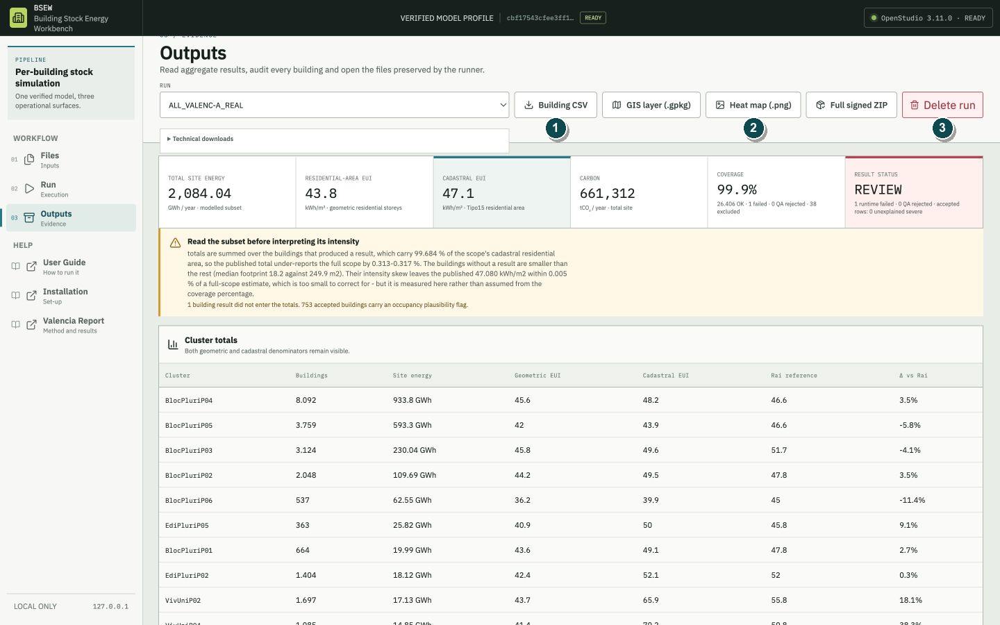

Figure 15 shows the same Outputs header as Figure 8, read this time for its download actions: **1** marks **Building CSV** beside **GIS layer (.gpkg)**, **2** marks **Heat map (.png)** beside **Full signed ZIP**, and **3** marks **Delete run**.

## 9.2 Delete only after independent retention

**Delete run** is disabled for a running process. For a finished run, the interface requires the exact run name before permanent deletion, and the backend re-checks activity authoritatively. Before deleting, verify an independent backup, package hash/signature, citation dependencies and retention obligations. Acceptance testing must never delete a real run.

## 9.3 Open Building CSV in a spreadsheet

Import the file as UTF-8 CSV, retain the building reference as text, and do not let a spreadsheet convert identifiers to scientific notation or dates. Reconcile row count, unique reference and status counts with Outputs before filtering. Treat empty cells as unavailable evidence, not zero. Keep period and denominator fields beside every metric used in a pivot or figure.

## 9.4 Open the GeoPackage in QGIS

Open `results_buildings.gpkg` as a vector dataset and retain its declared CRS. Start with the building layer and supplied style; then inspect the status field so failed/excluded features remain visible with null energy rather than disappearing. Use the provided cluster/district layers where present. Do not reproject or join by row order; join only by the documented building identity.

All figures in this guide are path-scrubbed real Workbench captures. The active-run monitor is explicitly labelled operational evidence; final result figures come only from settled runs.

<!-- pagebreak -->

# 10. Metric reading contract

Every reported metric should be read through six fields: visible name, authoritative source, unit, period, denominator and interpretation limit. BSEW does not recompute physical results in the readable report; it may format units and labels and check consistency among preserved evidence blocks.

| Visible metric | Authoritative source | Unit and period | Denominator | Interpretation limit |
|---|---|---|---|---|
| Total site energy | Building `results` records aggregated for successful rows | kWh/year or GWh/year for annual runs | None for the total | Modelled final site energy, not measured utility use. |
| Whole-site energy over geometric residential area | Recorded aggregate/result fields | kWh/m²·year | Geometric residential floor area | Includes all site energy in the numerator; use for the declared comparison convention only. |
| Whole-site energy over cadastral area | Recorded aggregate/result fields | kWh/m²·year | Cadastral Tipo15 residential area | Sensitive to cadastral/modelled area allocation. |
| Energy over conditioned area | Recorded results | kWh/m²·year | Total conditioned model area | Different from the residential-only denominators. |
| Operational carbon | Recorded carbon block | tCO₂/year or event-period tCO₂ | None for the total | Operational factors only; not embodied or measured emissions. |

Missing optional evidence is shown as an em dash. A measured zero remains `0`. Invalid types, booleans as numbers, NaN and infinity must not be printed as valid metrics.

# 11. Area denominators and why they differ

One building-stock result can legitimately have several intensities because the numerator and denominator answer different questions. Never shorten all of them to “EUI” without naming the area basis.

**Geometric residential area** is the modelled residential-storey area used by the comparison convention. **Cadastral Tipo15 area** is the administrative residential-area basis when available. **Conditioned area** is the area actually conditioned in the model, including applicable non-residential space.

The whole-site numerator can include commercial ground-storey energy while a residential-only denominator excludes that floor. This is a deliberate comparison convention, not the physical intensity of all conditioned space. Report both the convention and its limit.

Integer storey modelling can exceed a fractional cadastral area because an actual model needs whole storeys. The recorded top-storey fraction scales dwelling loads on the excess portion. The aggregate's floor-area allocation section describes the recorded rule and hypothetical alternatives; it must not rewrite a historical run using today's model rule.

When comparing cities, clusters or methods, require the same period, numerator and denominator. Similar numeric values under different bases are not equivalent observations.

# 12. Energy end uses and residential attribution

EnergyPlus Annual Building Utility Performance Summary values come from output meters. Subcategory splits depend on the model's user-defined end-use subcategories [5]. Use the preserved EnergyPlus result tables to inspect end uses and the readable report to understand how BSEW labels them.

Space heating, cooling and domestic hot water are model outputs under the recorded assumptions. Electricity and gas contribute to total site energy. Rounding in exported EnergyPlus tables can create small differences when individually rounded cells are summed; compare against authoritative preserved totals at their recorded precision.

`residential_site_kwh` is not an exact residential subtotal. Commercial lighting and equipment can be separated by subcategory, but HVAC and domestic hot water are not fully separable by space type in the preserved meter contract. The correct label is **residential-attributed upper bound**. Do not call it measured residential consumption or a physical residential EUI.

When there is no commercial space, the report should not claim commercial consumption merely because a metering configuration exists. When the ground storey is residential, use neutral language such as “ground-storey openings”; reserve “shopfront” for a commercial ground regime.

# 13. Operational carbon

BSEW records operational emissions derived from final-energy results using project factors. The current verified contract uses 0.331 kgCO₂ per kWh of electricity and 0.252 kgCO₂ per kWh of final natural gas, documented against the cited IDAE technical source [6].

Interpretation limits:

- the result is operational, not embodied or whole-life carbon;
- it is calculated from simulated final energy, not measured emissions;
- factors represent the adopted evidence basis and may not match a different year, supplier or marginal-emissions question;
- annual runs use `tCO₂/year`;
- event runs use **event-period operational emissions** and never `/year`;
- an unrecorded period makes otherwise successful evidence incomplete for citation.

Report factors beside the result or in the methods section. Do not convert them into a claim of certification or regulatory compliance. If a future study uses different factors, it should preserve the original energy result and clearly version the derived carbon method.

## 13.1 Domestic hot water assumption

The cited CTE reference demand of 28 litres per person per day is specified at 60 degrees Celsius [7]. A model implementation at 50 degrees Celsius is not automatically equivalent. State both the reference and implementation temperatures and avoid claiming direct CTE equivalence.

<!-- pagebreak -->

# 14. Building CSV

The user-facing **Building CSV** is intended for analysis in spreadsheet, statistical and GIS workflows. The final curated export uses the stable academic schema documented in the grouped field appendix of this guide. It remains distinct from the backward-compatible raw ledger representation used internally.

For every column, the dictionary should state:

- visible column name;
- authoritative ledger source field;
- data type;
- unit;
- period;
- denominator, when applicable;
- missing-value rule;
- interpretation limit.

The export must preserve the status of every in-scope reference. Excluded and failed records are not silently dropped or converted to zero. Numeric columns must remain numeric; measured zero and missing evidence must remain distinct. Boolean and categorical values should use a documented representation.

Before analysis, verify run identity, row count, unique building reference, status counts, period and profile fingerprint against the selected run. Keep the downloaded file hash in the analysis log. If the curated export is regenerated from a settled ledger, no EnergyPlus rerun is required; the transformation must be deterministic and tested against the ledger's latest record per reference.

The final Outputs figure above shows the user-facing Building CSV action; the grouped field appendix below is its complete publication dictionary.

# 15. GIS layer

The GeoPackage export joins building geometry to recorded result fields and may include aggregate layers such as cluster or district summaries and style metadata. Use it when spatial analysis requires vector geometry, feature-level attributes or reproducible GIS styling [9].

Check before use:

- coordinate reference system;
- geometry validity and feature count;
- one-to-one relationship between building reference and latest run record;
- status representation for successful, excluded and failed records;
- units and denominators of mapped attributes;
- field-name mapping to the Building CSV field appendix;
- whether any geometry lies outside a chosen display frame.

A GIS layer is not a basemap and should not require an external network service for core evidence. When overlaying third-party boundaries or imagery, cite their source, date and licence separately.

Aggregate district or cluster intensities should use the declared area-weighted contract. Do not average per-building intensities arithmetically unless that is the research question. If a district layer is empty because the required district field was not available, report it as unavailable rather than a district total of zero.

# 16. Heat map

The heat map is a publication-oriented spatial summary derived from the settled result geometry. It must identify the run, period, metric, denominator, colour-scale treatment, coverage and simulation boundary.

For annual Valencia evidence, panels may show whole-site energy over geometric residential area, space heating and cooling in kWh/m²·year. Event runs must state the event duration and must not be annualised by label. A metric constant across the entire stock should be omitted with an explicit note rather than rendered with a misleading colour range.

Percentile clipping, such as P2-P98, preserves visible contrast but does not change underlying values. The final map should disclose numeric limits and counts below/above the display range. Successful, excluded, failed and metric-missing records require a separate status legend.

Disconnected or distant valid geography must not disappear from the figure. The final Valencia map uses a main view and evidence-preserving inset logic so every valid building is visible at least once. It states the CRS, profile fingerprint and the **simulated, not measured consumption** boundary.

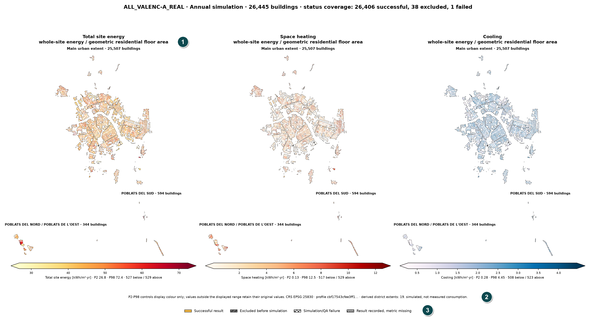

In Figure 16, **1** is the panel metric with its declared denominator, **2** is the P2-P98 display note, and **3** is the status legend separating simulated, failed, excluded and metric-missing buildings.

# 17. Readable building report

Select a building row to open the readable building report. The report is the primary human-readable bridge between stock totals and preserved technical files. It uses the authoritative `results`, `carbon` and `qa` blocks; duplicate summary fields are consistency checks, not alternate sources.

The report should present:

1. identity, period and publication status;
2. interpretation summary;
3. scope and limitations;
4. energy and emissions results;
5. geometry and occupancy;
6. QA and diagnostics;
7. model preparation and assumptions;
8. provenance, references and technical evidence.

If protected evidence blocks conflict, the report must show **EVIDENCE CONFLICT — DO NOT CITE** rather than silently selecting a value. A route/ledger/building identity mismatch should prevent report production. A successful-looking record without essential period, result or QA evidence is **INCOMPLETE EVIDENCE — DO NOT CITE**.

The readable report is academic English with an A4 print layout. Its screen presentation uses semantic headings, labelled links, keyboard focus and a WCAG 2.2 AA accessibility target [10]. Absolute local filesystem paths are excluded. Identifiers and fingerprints remain visible because they establish reproducibility.

The readable-report figure above uses a settled `ALL_VALENC-A_REAL` building and keeps the metric basis and classified diagnostic status visible.

# 18. EnergyPlus result tables and technical files

**EnergyPlus result tables** are directly visible in Readable Evidence because they contain the original annual simulation tables, including areas, end uses, zone results and comfort evidence. Read them together with the report's definitions and limitations.

The original technical files remain available for specialist audit:

- `eplustbl.htm`: EnergyPlus HTML result tables;
- `eplusout.err`: warnings, severe and fatal diagnostic log;
- `model_python.osm`: generated OpenStudio model;
- `deep_layers.json`: machine-oriented record of preparation stages and checks;
- geometry scene/model evidence where available.

These files are not hidden evidence; they are separated because their native formats are designed for engines and specialists. The readable report must not replace or alter them. If a publication depends on a precise end-use value or diagnostic classification, cite the readable explanation and retain the original technical file in the audit package.

Do not copy malformed ordinal names from raw technical objects into academic prose. If a raw identifier must be shown, label it explicitly as a raw model identifier and format it as code.

<!-- pagebreak -->

# 19. QA decision matrix

BSEW uses explicit publication statuses:

| Status | Required evidence | Permitted interpretation |
|---|---|---|
| FAILED / DO NOT USE | Failed run result, QA false, Fatal, or unexplained Severe | Do not cite as an accepted building result. |
| ACCEPTED WITH CLASSIFIED DIAGNOSTICS | Successful result; recorded checks pass; no Fatal/unexplained Severe; project-classified benign Severe exists | May be used only with the project-specific diagnostic classification disclosed. |
| PASS | Successful result; QA passed; no Severe or Fatal | Accepted under the recorded QA contract. |
| NOT ASSESSED | No sufficient QA decision was recorded | Do not infer pass. |
| INCOMPLETE EVIDENCE — DO NOT CITE | Essential result, period, QA or diagnostic evidence is missing | Do not cite until evidence is complete. |

Status is communicated with words and symbols, never colour alone. `PASS` does not mean measured calibration or universal model validity; it means that the recorded checks and diagnostic gates passed.

## 19.1 Classified Severe messages

EnergyPlus generally treats Severe messages as conditions requiring correction [8]. A project may classify a narrowly measured pattern as benign under an explicit acceptance rule. **ACCEPTED WITH CLASSIFIED DIAGNOSTICS** makes that exception visible. Review the actual message markers and the classification basis; do not shorten the status to PASS.

# 20. QA checks and tolerances

The readable QA table uses human-readable check names beside machine keys. Its columns distinguish expected/model value, observed value or accepted interval, acceptance criterion and result.

Key tolerances are reported in reader-facing units:

- a stored ratio tolerance of `0.005` is shown as `±0.5%`;
- `0.02` is shown as `±2%`;
- annual unmet hours are accepted only when the recorded value is `≤500 h`.

Some checks compare the built model with EnergyPlus-reported evidence. A plausibility-band check is different: it evaluates the method against a declared research range and must not be described as an EnergyPlus cross-check.

Review failed checks at building level and in aggregate. A zero QA-failure count does not resolve exclusion bias, input uncertainty or model-form limitations. Conversely, a failed or excluded building is not evidence of zero demand.

When exporting a QA table, preserve the original key for reproducibility but lead with the readable name and criterion. Do not leave naked machine keys as the only academic explanation.

# 21. Geometry, floors and occupancy

The model simplifies cadastral geometry into a tractable building representation. The report distinguishes total residential levels, effective residential storeys and any storey-rule adjustment. These terms are not interchangeable.

Ground-storey interpretation is conditional on the recorded final use:

- a residential ground storey is a dwelling space, thermostat-controlled and included in the residential area basis;
- a commercial ground storey follows the verified tertiary-use regime and is excluded from the residential-only denominator;
- mixed or missing evidence must be described without forcing either narrative.

Occupancy reporting separates the administrative Padrón value, the person count applied to the model, any density cap, and cluster-median imputation. Padrón is not real-time occupancy. A zero recorded population, an imputed value and a capped value are distinct evidence states.

Footprint simplification fidelity and storey snapping are recorded quality fields. A high-fidelity score does not establish survey accuracy; it describes the transformation relative to the supplied geometry. Buildings without a usable exterior wall may legitimately have zero glazed subsurfaces, which should be stated explicitly rather than treated as missing data.

# 22. Provenance and reproducibility

A citable result needs more than a run name. Preserve:

- run identity and final status;
- input dataset filenames and content fingerprints;
- verified profile fingerprint;
- software commit;
- climate/template/policy/stock-source/runner-schema identities;
- run configuration and process record;
- durable ledger and final aggregate;
- EnergyPlus/OpenStudio versions;
- generated CSV/GIS/heat map hashes;
- selected building reports and original technical evidence;
- review date and reviewer decision.

The report should use logical dataset names, filenames and hashes, not absolute local paths. Unpublished research-group evidence must be labelled as such with filename, verification date and fingerprint; do not invent bibliographic metadata.

## 22.1 Consistency checks

When the same metric is preserved in both authoritative and summary blocks, compare them. A contradiction is a reportable evidence conflict. When rebuilding an aggregate from a ledger, verify that all latest records share the intended profile identity; a mechanically combined multi-profile ledger must not appear as one homogeneous run without an explicit warning.

Reproducibility means another authorised researcher can identify and inspect the same evidence and method. It does not guarantee identical wall-clock time or remove uncertainty from the original data.

<!-- pagebreak -->

# 23. Export, integrity and retention

Use the smallest export that preserves the evidence needed for the research claim:

- Building CSV plus dictionary for row-level statistical analysis;
- GeoPackage and style for spatial analysis;
- heat map for communication, never as the sole numeric evidence;
- signed building package for a focused audit;
- full signed ZIP only when storage, duration and purpose justify it.

A signed manifest verifies that package contents match the recorded manifest and signing key. It does not certify scientific validity. Verify signatures and hashes after transfer and retain the verification log.

Do not delete a real run during acceptance testing. User-controlled deletion requires the exact run name and must be refused authoritatively while a process is active. Before deleting a finished run, verify independent backup, export integrity, citation dependencies and retention obligations.

The final result folder is a verified copy outside the original run root. The original `out/stock/ALL_VALENC-A_REAL/` remains in place so run identity, routes and signed export sources are not broken. Copy acceptance requires source-to-target SHA-256 equality.

# 24. Reporting checklist for academic use

## 24.1 Methods section

Report BSEW name and commit; Python/OpenStudio/EnergyPlus versions; run name; input and profile fingerprints; scope; period; worker/retention configuration where relevant; principal modelling assumptions; exclusion policy; QA criteria; energy denominators; carbon factors; and the logical evidence-package identifier or repository location. Do not publish a local absolute path.

## 24.2 Results section

Report final successful, failed and excluded counts; coverage with an honest bias statement; total energy and named intensity bases; operational carbon with period; cluster/district method; diagnostics status; and uncertainty or limitation that materially affects interpretation.

## 24.3 Figures and tables

Every figure caption should include run, period, metric, unit, denominator, coverage and simulated-not-measured boundary. Every table should identify the source export and hash. Explain percentile clipping and missing-status encoding on maps.

## 24.4 Minimum review before citation

- final process gone and aggregate settled;
- run/profile/input identities consistent;
- no evidence conflict or incomplete-citation status;
- QA matrix reviewed, including classified diagnostics;
- CSV/GIS/map counts reconciled to the ledger;
- hashes and manifest recorded;
- claims use simulation language and correct denominators;
- local paths, personal information and unauthorised source files absent.

<!-- pagebreak -->

# 25. Limitations and responsible interpretation

The final Valencia publication must retain these boundaries where relevant:

- cadastral geometry and area are administrative inputs with measurement and allocation limits;
- a parcel is not always a single physical building;
- integer-storey modelling and simplified zoning affect floor-area representation;
- large one-zone buildings may not represent core/perimeter diversity;
- courtyard and difficult geometry can be excluded by current preparation rules;
- occupancy uses administrative evidence, caps and, where recorded, imputation;
- HVAC and DHW cannot be cleanly split between residential and commercial space in the preserved meter contract;
- operational factors do not include embodied carbon;
- one verified profile does not constitute per-building calibration;
- LHS evidence for a pilot building is not a city-total uncertainty band;
- failed and excluded records can create unquantified truncation when a common area basis is absent.

Limitations are not an appendix to be ignored. Place the relevant limitation beside the metric, figure or comparison it constrains. A concise visible warning is more scientifically useful than a long disclaimer disconnected from the result.

<!-- pagebreak -->

# Appendix A. Building CSV and GIS field dictionary

This appendix is the publication contract for the user-facing **Building CSV** and the `results` layer of the GeoPackage. Field names are case-sensitive. A blank cell means that the source record does not provide that evidence; it must not be replaced by zero. Curated carbon totals use period-neutral field names; the recorded `run_mode`, `event_days` and `event_window` determine whether the value covers a year or an event. A backward-compatible raw ledger may retain historical `_yr` keys, but those keys are not the publication schema and an event value must never be exposed to the user under a per-year label.

The final publication check compares this appendix mechanically with the exported header. A published field may not be missing, undocumented or defined twice. Internal path or bulk-debug values (`model_osm`, `traceback`, nested `detail` and absolute filesystem paths) are deliberately excluded from the curated CSV. They remain available only through protected technical evidence where appropriate. The GeoPackage carries the same scalar evidence wherever available, adds geometry and stock context, and omits those same path or bulk-debug values.

## A.1 Identity, status and period

| Field | Applies to | Meaning and interpretation |
|---|---|---|
| `refparcela` | CSV + GIS | Cadastral/building reference used as the row identity and stock join key. Import as text. |
| `status` | CSV + GIS | Latest standing outcome for the reference: normally `ok`, `failed`, `failed_qa` or `excluded`. |
| `reason` | CSV + GIS | Stable reason code for a non-successful record; blank for an ordinary successful row. |
| `message` | CSV + GIS | Short human-readable diagnostic where one was recorded. It is evidence, not a substitute for the technical log. |
| `cluster` | CSV + GIS | Applied typology/cluster classification. |
| `nombre` | GIS context | District or source-area label borrowed from the prepared stock when available. |
| `run_mode` | CSV + GIS | `annual` or `microclimate_event`; absent in a legacy annual record only where the preserved run contract establishes annual mode. |
| `event_days` | CSV + GIS | Number of days in a microclimate event; blank for annual runs. |
| `event_window` | CSV + GIS | Recorded event date/time interval; blank for annual runs. |
| `delta_peak_k`, `delta_base_k` | CSV + GIS | Event climate temperature-offset parameters in kelvin where the microclimate adapter records them. They do not apply to an annual run. |
| `seconds` | CSV + GIS | Wall-clock processing time recorded for the building attempt, in seconds; not a physical building result. |
| `pruned_bytes` | CSV + GIS | Bytes removed by the selected retention policy after evidence preservation. |

## A.2 Energy results

| Field | Unit and period | Meaning and denominator |
|---|---|---|
| `total_site_kwh` | kWh per recorded period | Total final site energy from the preserved EnergyPlus meters for the complete modelled building. |
| `space_heating_kwh`, `cooling_kwh`, `dhw_kwh` | kWh per recorded period | End-use final energy for space heating, cooling and domestic hot water. These are modelled meter results. |
| `total_site_kwh_m2` | kWh/m² per recorded period | Total site energy divided by geometric residential-storey area. Commercial energy can be in the numerator while commercial floor is outside this denominator; use for the named accounting comparison, not as conditioned-floor intensity. |
| `total_site_kwh_m2_conditioned` | kWh/m² per recorded period | Total site energy divided by total conditioned floor area. |
| `space_heating_kwh_m2`, `cooling_kwh_m2`, `dhw_kwh_m2`, `fans_kwh_m2`, `pumps_kwh_m2`, `lighting_kwh_m2`, `equipment_kwh_m2` | kWh/m² per recorded period | Named end use divided by geometric residential-storey area. Keep the denominator note with any reported value. |
| `space_heating_kwh_m2_conditioned`, `cooling_kwh_m2_conditioned` | kWh/m² per recorded period | Heating or cooling divided by total conditioned area. |
| `site_gas_kwh_m2`, `site_elec_kwh_m2` | kWh/m² per recorded period | Final site gas or electricity divided by geometric residential-storey area. |
| `residential_site_kwh` | kWh per recorded period | Residential-attributed upper bound after commercial lighting and equipment are removed. HVAC and DHW cannot be spatially separated, so this is not an exact residential subtotal. |
| `terciario_site_kwh` | kWh per recorded period | Commercial-attributed lighting and equipment recorded for the Terciario portion. Blank or zero does not create a commercial space where none exists. |
| `residential_total_site_kwh_m2` | kWh/m² per recorded period | Residential-attributed upper bound divided by residential area; subject to the same HVAC/DHW allocation limitation. |
| `dhw_share_pct`, `terciario_share_pct` | % | Share of total site energy attributed to DHW or the defined commercial component. |
| `total_site_kwh_per_person` | kWh/person per recorded period | GIS-derived total site energy divided by registered population; NULL where population is zero or unavailable. |
| `total_site_kwh_per_dwelling` | kWh/dwelling per recorded period | GIS-derived total site energy divided by recorded dwellings; NULL where the dwelling count is zero or unavailable. |

## A.3 Operational carbon

| Field | Unit and period | Meaning and limitation |
|---|---|---|
| `total_site_co2_kg_m2` | kgCO₂/m² per recorded period | Modelled operational emissions divided by geometric residential-storey area. It is factor-based, not measured and excludes embodied carbon. |
| `hvac_co2_kg_m2` | kgCO₂/m² per recorded period | Operational HVAC-related emissions intensity under the preserved allocation rule. |
| `total_site_co2_t` | tCO₂ per recorded period | Total operational emissions. Read with `run_mode`: annual means one year; microclimate means only the recorded event window. |
| `hvac_co2_t` | tCO₂ per recorded period | HVAC-related operational emissions under the same annual/event-period rule. |

The carbon factors and their scope must be reported with these fields: 0.331 kgCO₂/kWh_final for electricity and 0.252 kgCO₂/kWh_final for natural gas in this verified Valencia profile [6].

## A.4 Area, geometry and storeys

| Field | Unit | Meaning |
|---|---|---|
| `footprint_m2` | m² | Prepared/modelled footprint area associated with the reference. |
| `res_area_m2` | m² | Geometric residential-storey area used by the principal residential-area denominator. |
| `tipo15_res_area_m2` | m² | Residential area from the joined Tipo15 ledger where available. |
| `res_area_source` | text | Provenance label for the residential-area value used. |
| `total_conditioned_area_m2` | m² | Total conditioned floor area represented in the model. |
| `conditioned_to_cadastral_ratio` | ratio | Total conditioned area divided by the cadastral residential-area evidence; a dimensionless diagnostic, not an energy result. |
| `altura_max` | source unit | Height/floor evidence borrowed from the prepared stock for GIS context. Interpret with the stock data contract, not as a recomputed model result. |
| `n_floors_total` | count | Total modelled storeys, including a commercial ground storey where applicable. |
| `n_floors_residential` | count | Residential storey count before the effective top-storey allocation is expressed. |
| `residential_storeys_effective` | storey equivalents | Residential storeys effectively carrying residential floor-area/load allocation in the run. |
| `built_storeys` | count | Integer storeys geometrically built by the model. |
| `top_storey_fraction` | ratio | Fraction of the upper modelled storey carrying residential allocation. |
| `storey_cap_applied` | boolean | Whether the recorded storey cap changed the applied count. |
| `mixed_use_storeys_converted` | count | Storeys converted under the recorded mixed-use policy. |
| `mixed_use_basis` | text | Evidence/rule used to apply the mixed-use conversion. |
| `large_footprint_single_zone` | boolean | Whether the building falls under the recorded large-footprint, one-zone-per-storey limitation. |
| `footprint_fidelity` | ratio | Symmetric-difference area between prepared and raw footprints divided by raw area. The configured acceptance bound is 0.01. |
| `simplify_tolerance_used_m` | m | Geometry simplification tolerance actually used after fidelity refinement. |
| `storey_rule_margin` | ratio | Distance from the relevant integer-storey decision expressed by the recorded storey rule. |
| `storey_rule_snapped` | boolean | Whether measurement-resolution snapping changed the applied integer storey outcome. |
| `n_party_surfaces`, `n_shading_surfaces`, `n_windows` | count | Counts of party surfaces, shading surfaces and window subsurfaces in the prepared model evidence. |
| `window_area_m2` | m² | Total modelled window area. This supports an audit but does not by itself reconstruct facade-specific WWR. |

## A.5 Occupancy, use and construction

| Field | Unit | Meaning |
|---|---|---|
| `pob_total` | persons | Registered population context from the prepared stock. It is administrative evidence, not real-time occupancy. |
| `num_vivend` | dwellings | Recorded dwelling count from the prepared stock. |
| `dwelling_area_m2` | m² | Residential dwelling-area basis used by the applied occupancy/load policy. |
| `padron_occupants` | persons | Padrón-derived population evidence before model policy adjustments. |
| `occupants_applied` | persons | Occupant count applied to the simulation after the recorded cap or imputation policy. |
| `occupants_source` | text | Origin of the applied occupancy value, such as Padrón evidence or cluster-median imputation. |
| `occupancy_plausibility` | text | Recorded plausibility classification; it is a review flag rather than a measured truth label. |
| `ground_use` | text | Applied ground-storey use, for example residential or commercial/Terciario. |
| `ground_use_source` | text | Evidence source or rule used to determine ground-storey use. |
| `wall_construction`, `roof_construction` | text | Applied construction identifiers. These are model assignments, not in-situ measurements. |

## A.6 QA and diagnostics

| Field | Meaning |
|---|---|
| `qa_all_passed` | Whether all recorded quantitative QA checks passed. It must be interpreted with Severe/Fatal counts and final status. |
| `warnings` | EnergyPlus warning count recorded for the simulation. |
| `severes` | Total EnergyPlus Severe diagnostic count. |
| `severes_benign_shading_ems` | Severe messages matching the project-classified, measured benign shading/EMS exception. The classification is project-specific and does not redefine EnergyPlus severity. |
| `severes_unexplained` | Severe messages not covered by the classified exception. Any non-zero value makes the result unsuitable for citation. |
| `fatals` | EnergyPlus Fatal diagnostic count. Any non-zero value makes the result unsuitable for use. |

The readable report resolves these fields into `PASS`, `ACCEPTED WITH CLASSIFIED DIAGNOSTICS`, `FAILED / DO NOT USE`, `NOT ASSESSED` or `INCOMPLETE EVIDENCE — DO NOT CITE`. Do not infer that status from `qa_all_passed` alone.

## A.7 Provenance and reproducibility

| Field | Meaning |
|---|---|
| `profile_fingerprint` | Fingerprint of the verified model profile used by the run. |
| `climate_fingerprint` | Fingerprint of the active weather/climate evidence. |
| `template_fingerprint` | Fingerprint of the OpenStudio template. |
| `policy_fingerprint` | Fingerprint of the immutable stock/run policy. |
| `stock_source_fingerprint` | Fingerprint of the prepared stock source. |
| `runner_schema` | Version/fingerprint of the ledger schema and runner evidence contract. |
| `zero_policy` | Preserved rule governing zero-valued end uses and related acceptance. |

`run_identity` is a nested internal record and is not emitted as an opaque CSV cell. Its citeable scalar identities are exposed through the fingerprint fields above and through the run manifest. A hash proves content identity, not scientific validity.

## A.8 GeoPackage-only structure and roll-up layers

The GeoPackage contains geometry plus three logical layer types:

| Layer | One feature represents | Principal fields |
|---|---|---|
| `results` | One dissolved cadastral/building reference, including failed and excluded references | The applicable scalar fields in A.1–A.7, `geometry`, and GIS context/derived fields. Failed or excluded records retain geometry with NULL energy. |
| `by_cluster` | One dissolved typology/cluster | `cluster`, `buildings`, `buildings_measured`, `res_area_m2`, `total_site_kwh`, `total_site_gwh`, area-weighted end-use/carbon intensities, `pob_total`, `num_vivend`, `geometry`. |
| `by_district` | One dissolved district where a district field exists | `nombre`, the same coverage, area, energy, intensity, population and dwelling fields as `by_cluster`, plus `geometry`. |

`buildings` counts all mapped references in the zone; `buildings_measured` counts accepted result rows contributing to energy totals. Intensities in roll-up layers are floor-area weighted, not simple means of building intensities. The packaged `layer_styles` metadata and QGIS style are display aids; numeric interpretation still comes from the attributes, units, period and coverage.

## A.9 Spreadsheet and QGIS acceptance check

After downloading the CSV, import UTF-8, preserve `refparcela` as text, confirm a single header row, and compare unique references and status counts with Outputs. After opening the GeoPackage in QGIS, confirm the expected CRS, open all available layers, compare `results` feature/status counts with Outputs, and verify that missing results are visible as grey/NULL rather than silently absent. A discrepancy is an evidence-integrity problem: stop analysis, retain both files and record their hashes before investigation.

<!-- pagebreak -->

# 26. References

[1] Python Software Foundation, “Python 3.13 documentation,” https://docs.python.org/3.13/  
[2] NREL, “OpenStudio 3.11.0 release,” https://github.com/NREL/OpenStudio/releases/tag/v3.11.0  
[3] EnergyPlus, “EnergyPlus 25.2 documentation,” https://energyplus.readthedocs.io/en/v25.2.0/  
[4] OpenJS Foundation, “Node.js downloads,” https://nodejs.org/en/download  
[5] U.S. Department of Energy, *EnergyPlus Input Output Reference*, version 25.2; HTML rendering of the release documentation by Big Ladder Software, https://bigladdersoftware.com/epx/docs/25-2/input-output-reference/index.html  
[6] Instituto para la Diversificación y Ahorro de la Energía, *La bomba de calor en la rehabilitación energética de edificios*, 2023, https://www.idae.es/sites/default/files/documentos/publicaciones_idae/Guias_IDAE_La_Bomba_de_calor_2023_V11.pdf  
[7] Gobierno de España, *Código Técnico de la Edificación, DB-HE*, 2017 edition, https://www.codigotecnico.org/pdf/Documentos/HE/DBHE_201706.pdf  
[8] U.S. Department of Energy, *EnergyPlus Essentials*, version 25.2, https://energyplus.readthedocs.io/en/v25.2.0/essentials/essentials.html  
[9] Open Geospatial Consortium, “GeoPackage Encoding Standard,” https://www.ogc.org/standard/geopackage/  
[10] W3C, “Web Content Accessibility Guidelines (WCAG) 2.2,” https://www.w3.org/TR/WCAG22/  
